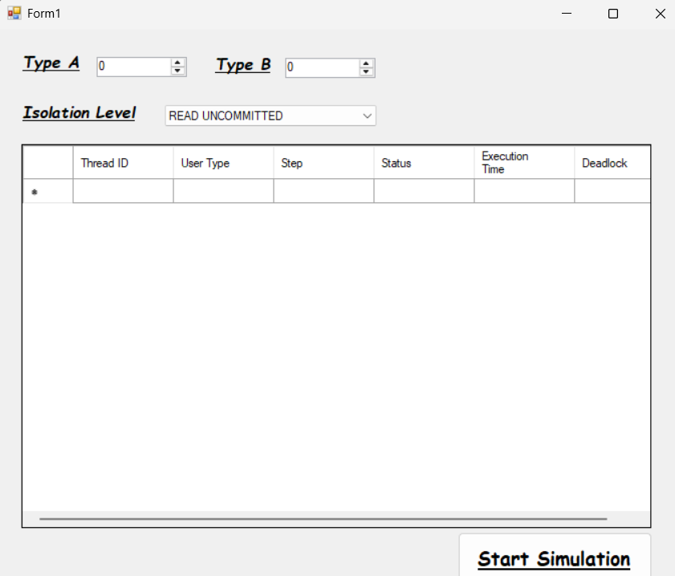
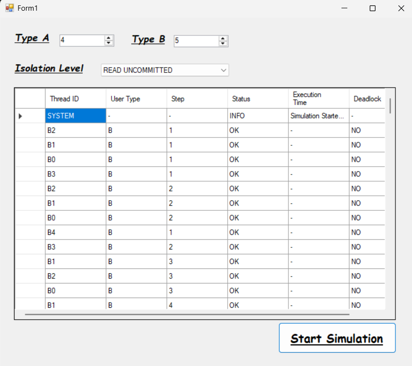
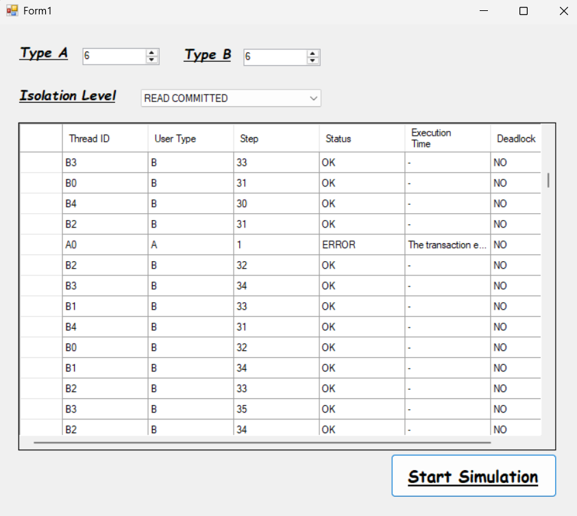
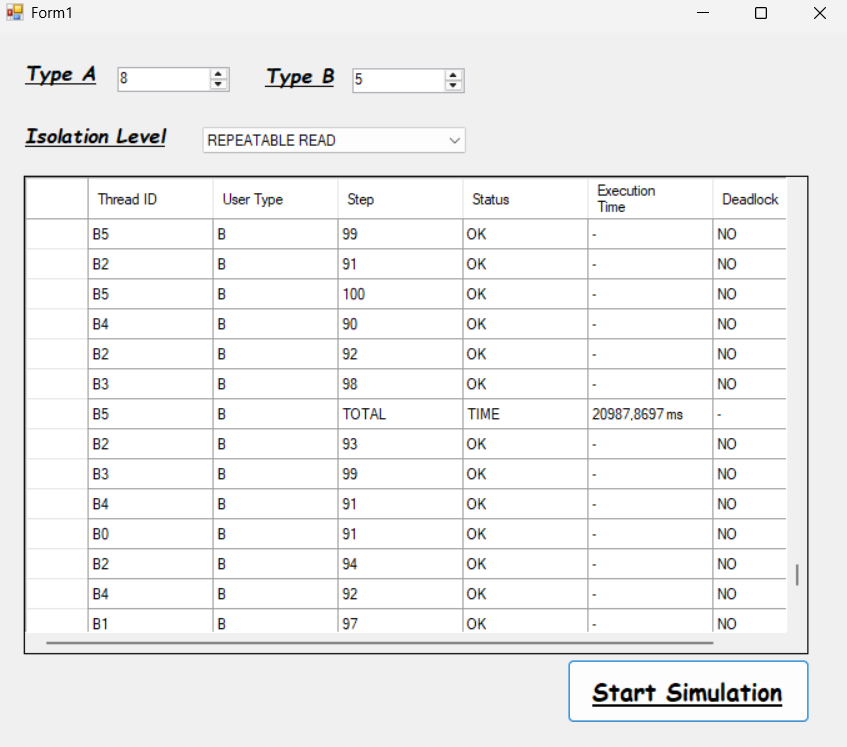
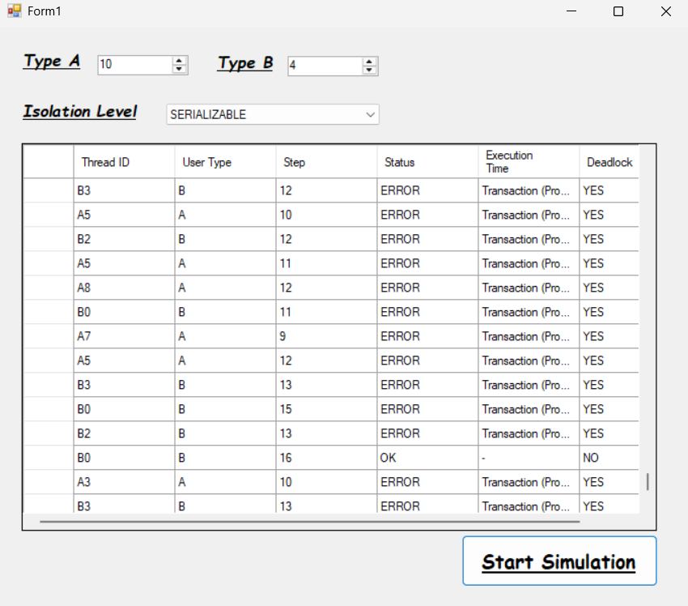

# Database Isolation Level Simulator (C# / WinForms)

This project is a **C# WinForms simulation tool** that demonstrates how different
**SQL transaction isolation levels** affect concurrency behavior, execution flow,
and deadlock risk.

The system runs concurrent operations from two user types (Type A / Type B),
logs each thread step-by-step, measures execution time, and detects deadlocks.

---

## 🎯 Purpose
The goal is to provide a practical, visual way to observe:
- How isolation levels impact concurrent access
- How conflicts appear as errors or blocks
- When deadlocks are more likely to occur
- The performance trade-offs between isolation levels

---

## 🧩 How It Works
- The user selects the number of concurrent workers for **Type A** and **Type B**
- An **isolation level** is selected from the UI
- The simulation starts and logs:
  - Thread ID
  - User type (A/B)
  - Step number
  - Status (OK / ERROR / INFO)
  - Execution time summary
  - Deadlock detection (YES/NO)

---

## 🖥 Screenshots

### 1) Application UI (Start)

### 2) READ UNCOMMITTED – Example Run

### 3) READ COMMITTED – Example Error/Conflict

### 4) REPEATABLE READ – Timing Output Example

### 5) SERIALIZABLE – Deadlock Example

---

## 🛠 Tech Stack
- C# (WinForms)
- Visual Studio
- SQL transaction concepts (isolation levels, concurrency, deadlocks)
- Thread-based simulation + logging

---

## 📌 Notes
This project is primarily focused on **concurrency behavior and transaction theory**.
UI design is intentionally kept simple to emphasize correctness and traceability.

---

## 📄 Report
Detailed explanation and design documentation:

`report/SE308_term_project_report.pdf`
